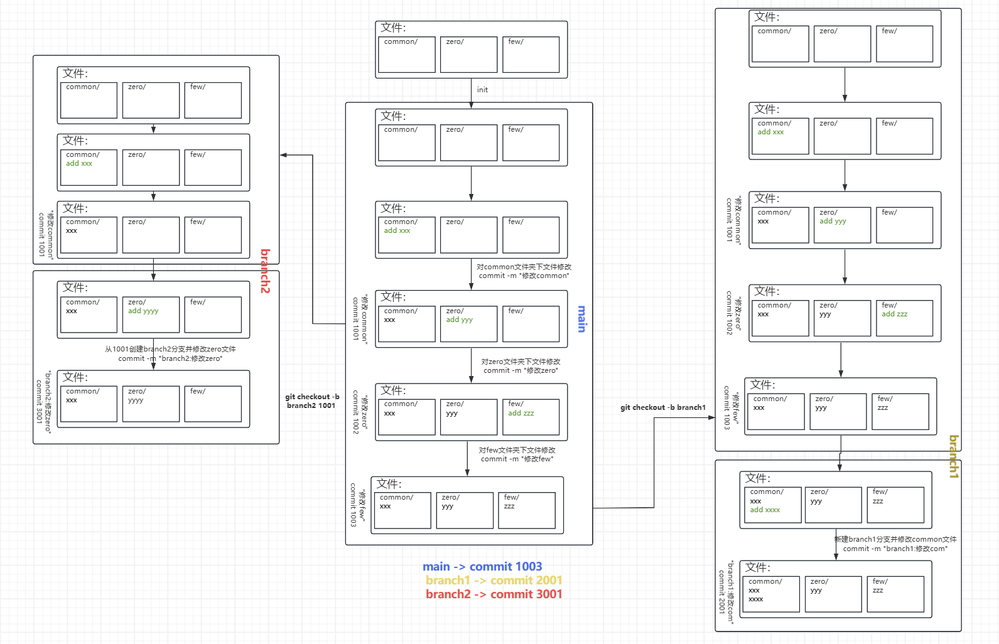

# 用户

新建用户  
```bash
useradd -m -s /bin/bash isaac
```
> `-m` → 自动创建 `/home/isaac` 家目录
> `-s /bin/bash` → 默认 shell

创建完用户之后，必须设置密码
```bash
passwd isaac
```

`~/`下隐藏文件
```bash
.bash_history
.bash_logout
.bash_profile
.bashrc
.viminfo
```
> - `.bashrc ` 定义 bash 的运行环境 (环境变量,conda初始化,prompt命令行样式)
> - `.bash_profile`  登录 shell 才会执行（比如 SSH 登录）
> - `.bash_logout` 退出 shell 时执行 (清屏清理临时状态)
> - `.bash_history` 记录执行过的命令 
> - `.viminfo` vim 编辑器的历史记录 

### .bashrc文件
```bash
# .bashrc

  

# Source global definitions

if [ -f /etc/bashrc ]; then

    . /etc/bashrc

fi

  

# User specific environment

if ! [[ "$PATH" =~ "$HOME/.local/bin:$HOME/bin:" ]]

then

    PATH="$HOME/.local/bin:$HOME/bin:$PATH"

fi

export PATH

  

# Uncomment the following line if you don't like systemctl's auto-paging feature:

# export SYSTEMD_PAGER=

  

# User specific aliases and functions
# >>> conda initialize >>>

# !! Contents within this block are managed by 'conda init' !!

__conda_setup="$('/home/isaac/miniconda3/bin/conda' 'shell.bash' 'hook' 2> /dev/null)"

if [ $? -eq 0 ]; then

    eval "$__conda_setup"

else

    if [ -f "/home/isaac/miniconda3/etc/profile.d/conda.sh" ]; then

        . "/home/isaac/miniconda3/etc/profile.d/conda.sh"

    else

        export PATH="/home/isaac/miniconda3/bin:$PATH"

    fi

fi

unset __conda_setup

# <<< conda initialize <<<
```

可以在`.bashrc`中加入相关的命令来更改shell prompt的格式
```bash

```

# 网络

## 配置当前终端使用代理网络下载相应的资源

```bash
export http_proxy=http://127.0.0.1:7890
export https_proxy=http://127.0.0.1:7890
```

## 将本地端口与服务器端口打通

```bash
ssh -L 本地端口:目标地址:目标端口 服务器用户名@服务器IP
# 示例
ssh -L 6006:localhost:6006 l@isaacyy.cn
```

# 存储

## 查看当前文件夹存储

```bash
du -sh *
```

# Git

## 第一次使用配置

设置 GitHub 账号：

```bash
git config --global user.name "name"
git config --global user.email "email"
```

SSH 密钥并配置到 GitHub：

1. 生成 SSH 密钥

   ```bash
   ssh-keygen -t ed25519 -C "GitHub邮箱"
   ```

2. 查看并复制公钥

   ```bash
   cat ~/.ssh/id_ed25519.pub
   ```

3. 把公钥粘贴到 GitHub

   打开 `GitHub` 的 `SSH and GPG keys`，创建新的 SSH 密钥。

## clone

打开要克隆到本地的文件夹后执行：

```bash
git clone git@github.com:ChandlerIsaac/ubuntu_cmd.git
```

## push

```bash
git status
git add .
git commit -m "本次修改说明"
git push
```

## pull

下载最新代码：

```bash
git pull
```

## git checkout

回到指定版本：

```bash
git checkout commit编号
```

回到最新版本：

```bash
git checkout main
```

## 分支相关命令



查看本地分支：

```bash
git branch
```

查看本地和远程分支：

```bash
git branch -a
```

创建新分支：

```bash
git branch 分支名
```

创建并切换到新分支：

```bash
git checkout -b 分支名
```

切换到已有分支：

```bash
git checkout 分支名
```

重命名当前分支：

```bash
git branch -m 新分支名
```

删除本地分支：

```bash
git branch -d 分支名
```

强制删除本地分支：

```bash
git branch -D 分支名
```

删除远程分支：

```bash
git push origin --delete 分支名
```

推送本地分支到远程并建立跟踪关系：

```bash
git push -u origin 分支名
```

拉取远程分支到本地并切换：

```bash
git checkout -b 分支名 origin/分支名
```

## git reset

彻底重置到指定版本（**危险！会覆盖当前代码**）：

```bash
git reset --hard commit编号
```
